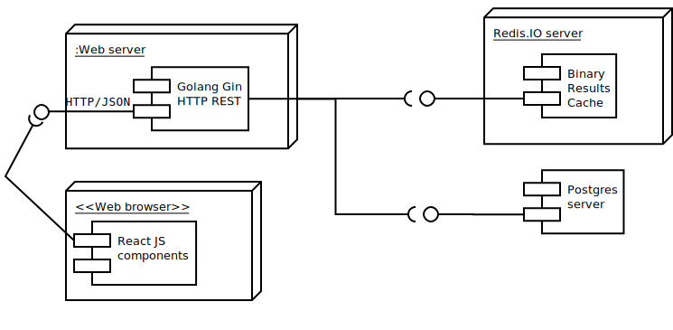

# Albums database sample api and web front-end

HTTP with REST bindings on gin router, with go-pg and redis storage.
The components all run on the localhost node, the Postgres DB is created manually.

